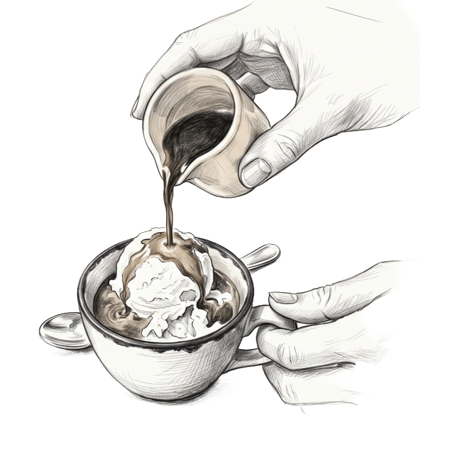

# Build Spec — Siena Dessert Menu Editor

Read this whole document before wiring the editor. This package shares
its constraint model and conventions with `../handoff-drinksdessert/` —
read that package's `BUILD-SPEC.md` too, especially §1a (n/a here) and
§1b (the holder crop line, which DOES apply here).

---

## 0. The physical product (READ THIS FIRST)

**This cuts into two separate 4.25in × 11in insert cards, exactly like
the Drinks Menu — it is NOT one uncut 8.5×11 page.** One physical
8.5in × 11in sheet prints both cards side by side; staff cut it in half
down the middle, and each half slides into the same hard menu holder as
the 4 Drinks Menu cards in `../handoff-drinksdessert/`. If a previous
version of this doc, or any conversation about it, described a single
uncut sheet or a "loose page" — that was a misunderstanding; the owner
has confirmed this in writing. Build the same way as the Drinks Menu's
two sheets:

1. **Dolci** (left half) — the dessert list.
2. **Siena Dopa Cena** (right half) — digestivi, grappa, ports, cognac &
   calvados, traditional Italian liqueurs. This card used to live on the
   Drinks Menu; it moved here when Liquori replaced it there.

**This is NOT two identical copies of one card.** An earlier version of
this package printed the same Dolci card twice, side by side, to save
paper. That model is gone — the two halves are now different content.
If you find code, docs, or a `data-copy-id` attribute anywhere assuming
two identical copies, it's stale — delete it, don't preserve it.

`template.html` models this as one `<div class="sheet">` containing two
different `<div class="page">` elements (`data-page-id="dolci"` /
`"dopacena"`) with a dashed `.cut-guide` between them.

### The cut guide never prints

The dashed line between Dolci and Dopa Cena is a **screen/editor
placement aid only**. It must never appear in the actual printed or
exported output — `template.html`'s `@media print` rule enforces this
(`.cut-guide { display: none !important; }` under print). Staff cut at
the known 4.25in mark; don't reintroduce a printed guide line, and don't
"fix" this rule if it looks like a regression — it's intentional.

---

## 1b. The holder crop line

Both cards share the same physical menu holder as the Drinks Menu's 4
cards, and that holder hides everything below **9.96in from the top of
any card**. This is a fixed hardware constant — see
`../handoff-drinksdessert/BUILD-SPEC.md` §1b for the full rationale.
`validate.js` in this package checks it independently for both Dolci
and Dopa Cena, exactly like the Drinks Menu package does for its four
cards. Keep the `CROP_LINE_IN` constant in both `validate.js` files in
sync if it's ever revised.

---

## 1. Constraint model — validate.js + a single 1pt shrink step

Both cards have **open-ended item counts** — no hard cap on either.

1. After every edit, render the candidate data into a live preview and
   call `SienaDessertValidate.validate(previewDoc)`.
2. The validator measures the Dolci and Dopa Cena `.page` elements
   **independently** — they're two different physical cards; one can
   overflow (or cross the crop line) while the other has slack.
3. **If a page fails either check at normal type size**, the validator
   tries exactly **one** fallback: `shrink-1pt` on *that page only*,
   dropping every dynamic text run by 1pt via CSS already in
   `template.html`. Page titles, subsection titles, and the Dolci
   illustration are never touched.
4. If the page passes both checks after that, save proceeds — show a
   subtle "reduced type" indicator for that card.
5. **If it still fails, block the save.** No second shrink step.

### Why not an auto-fit ladder?

Same reasoning as the Drinks Menu: neither card has disposable chrome
to shed. Block instead of silently degrading further.

---

## 2. Dolci — one list, a fixed illustration, and a deliberate non-center

- **The Dolci illustration is a static asset, not a data field.** It's
  hard-coded into `template.html` (``), pinned to the bottom of the
  card below the item list. It never changes with `data.dolci` and has
  no `data-item-id`; don't add an editor control for it — swapping it is
  a design change, not a content edit.
- **The item list is not vertically centered.** It sits about a quarter
  of the way down the space below the title — implemented as two flex
  spacers around the list in a 1:3 ratio (top:bottom); see
  `.dolci-spacer-top` / `.dolci-spacer-bottom` in `template.html`. A
  plain `justify-content: center` would put it at 1:1 and is NOT what's
  wanted here — this asymmetry is deliberate so the illustration reads
  as a bottom anchor rather than crowding the list. Don't "fix" it to
  true centering.
- Every Dolci item requires `name`, `desc`, and `price` — no optional
  field on this card.

---

## 3. UMD contract

```js
SienaDessertRender.render(document, data);     // mutates DOM in place
SienaDessertValidate.validate(document);       // measures & reports; needs a real browser
```

- Both are self-contained UMD files (browser global + `module.exports`).
- `render()` never checks fit — it's pure hydration, and uses
  `textContent` only (no `innerHTML` anywhere).
- `validate()` requires a real CSS layout engine
  (`getBoundingClientRect`, `scrollHeight`/`clientHeight`). **JSDOM
  cannot host it.** The snapshot test only exercises `render.js`.

---

## 4. Data shape

```jsonc
{
  "dolci": [ /* open-ended */ {
    "id": "ds-1", "name": "Sorbetti di Frutta",
    "desc": "Mango, Raspberry, Lemon", "price": "11.00"
  } ],
  "dopaCena": {
    "digestivo":         [ /* open-ended */ { "id": "dc-d1", "name": "Aperol", "price": "8.00" } ],
    "grappa":            [ /* open-ended — any item MAY carry `sub` */ ],
    "ports":             [ /* open-ended */ ],
    "cognac":            [ /* open-ended */ ],
    "traditionalItalian":[ /* open-ended */ ]
  }
}
```

### Price convention

**No `$` anywhere on this menu.** Store full-precision values
(`"11.00"`, `"8.25"`); `render.js`'s `formatPrice()` drops a trailing
`.00` for display (`"11.00"` → `"11"`) and keeps other cents as-is
(`"6.50"` stays `"6.50"`). Don't pre-strip `.00` or prepend `$` yourself.

### Item shape by list

| List | Fields | Notes |
|---|---|---|
| `dolci[i]` | `id`, `name`, `desc` (required), `price` (required) | No optional field. |
| `dopaCena.<sub>[i]` | `id`, `name`, `price` (required), `sub` (optional) | `sub` is a one-line note under the name/price row — e.g. a grappa's producing region ("Il Poggione \"Paganelli\"" → Brunello Riserva di Montalcino in the seed). Not reserved for any particular item; empty/missing removes the line. |

### IDs

Opaque, stable, mint-once per new item. Never recycle a deleted item's
ID.

---

## 5. Editable fields — full reference

| Field | JSON path | Required? | Notes |
|---|---|---|---|
| Dolci item name | `dolci[i].name` | required | Playfair Display italic, 16.5pt (shrinks to 15.5pt). |
| Dolci item description | `dolci[i].desc` | required | Montserrat, 12pt (shrinks to 11pt), wraps freely, centered. |
| Dolci item price | `dolci[i].price` | required | Playfair Display italic, 14.25pt (shrinks to 13.25pt). No `$`; trailing `.00` dropped. |
| Dopa Cena item name | `dopaCena.<sub>[i].name` | required | Montserrat semibold, 12.5pt (shrinks to 11.5pt). |
| Dopa Cena item price | `dopaCena.<sub>[i].price` | required | Playfair Display italic. No `$`; trailing `.00` dropped. |
| Dopa Cena item sub-note | `dopaCena.<sub>[i].sub` | optional | Available on every item, every subsection. Empty/missing removes the line. |

### Add / remove / reorder

Every list above supports add, remove, and reorder — no printed
maximum. The editor:

- Generates a fresh opaque `id` on add.
- Removes the item from its array on delete.
- Persists array order as the new canonical order.
- Must run `validate.js` after every such change and block save on
  `fits: false`.

---

## 6. Static / not editable

Baked into `template.html`, no data hooks, not surfaced in the editor:

- The "Dolci" title — flanked by dark rules, notably larger than every
  other page title in this project (28.5pt vs the usual 22pt).
- The "Siena Dopa Cena" title — plain centered text, **no** flanking
  rules (unlike Dolci's). This split mirrors the Drinks Menu, where
  Cocktails/Spirits & Beer titles are also plain while Spritz/Liquori
  keep rules — it's a deliberate, current design choice, not an
  inconsistency to fix.
- The five Dopa Cena subsection titles ("Digestivo", "Grappa · 2.5 oz",
  "Ports · 2.5 oz", "Cognac & Calvados", "Traditional Italian · 2.5
  oz") — fixed, in that order, each flanked by small ornamental rules.
  The editor cannot add, rename, or reorder them; only items within a
  subsection are editable.
- The Dolci illustration (`assets/dolci-affogato-sketch.png`) and its
  bottom-pinned position — see §2.
- The Dolci list's non-centered placement (the 1:3 spacer ratio) — §2.
- The `.cut-guide` dashed line, and the fact that it never prints — see
  §0.
- The holder crop line constant (§1b) — an engineering constraint,
  never a manager-facing setting.
- All typography, colors, card background, and page padding. Fonts,
  page size (4.25×11in per card / 8.5×11in per printed sheet).

If a manager wants a renamed title, a swapped illustration, or a
different card layout, that's an owner-level design change — surface it
as a request, don't build it into the editor.

---

## 7. DOM hooks (for renderer reference)

| Slot family | Selector pattern | Field |
|---|---|---|
| Card container | `[data-page-id="dolci"\|"dopacena"]` | validate.js measures each independently |
| Sheet container | `[data-sheet-id="dessert"]` | the one physical 8.5×11 print page |
| Any list | `[data-list-id="…"]` | render.js clears + repopulates; validate.js's `worstList` diagnostic |
| List IDs | `dolci`, `dopacena-digestivo`, `dopacena-grappa`, `dopacena-ports`, `dopacena-cognac`, `dopacena-traditionalItalian` | maps 1:1 to the JSON paths in §4 |
| Item | `[data-item-id="…"]` | one per JSON item, opaque stable ID |

The renderer uses `textContent` exclusively — no `innerHTML` anywhere.

---

## 8. Editor UI sketch

Two collapsible panels (Dolci, Dopa Cena), each with a live preview pane
that re-renders and re-validates on every edit (debounce ~300–500ms):

- Dolci panel: one open-ended list (name, description, price per row),
  drag-to-reorder. No control for the illustration — it's static (§2).
- Dopa Cena panel: five fixed subsection groups, each an open-ended
  list (name, price, optional sub-note), drag-to-reorder within a
  subsection; dragging across subsections is blocked.
- Status line: Dolci / Dopa Cena, each "fits" / "fits (reduced type)" /
  a blocking message naming the worst list.
- "Save" disabled while `report.fits === false` on either card.
- One print button — there's no sheet-choice picker like the Drinks
  Menu's Sheet A/B (only one sheet exists here).

---

## 9. Gotchas

- **`validate()` needs a real browser.** Run it in the editor's preview
  iframe, not Node/JSDOM.
- **Wait for fonts before validating.** Call
  `await SienaDessertValidate.waitForLayout(doc)` before `validate(doc)`.
- **The two cards are measured independently now.** Don't reintroduce
  the old "measure one, trust both" shortcut — Dolci and Dopa Cena are
  different content and can pass/fail independently.
- **A page can fail on the crop line alone**, even with no
  `overflowPx` — check `cropLineOk` too (§1b). `fits` is already the AND
  of both checks.
- **No `$` anywhere on this menu.** Unlike the Drinks Menu's Spritz
  page, there is no exception here.
- **The cut guide must never print.** Don't remove its `@media print`
  rule "to help staff see where to cut" — see §0.
- **The Dolci illustration is not manager content.** Don't add a
  data field or image-upload control for it.
- **Dopa Cena's `sub` field is available on every item, not one slot.**
  The seed happens to put one on "Il Poggione \"Paganelli\"" — that's
  just today's content, not a reserved field.
- **Special characters:** preserve curly quotes, en/em dashes, middle
  dots, and accented letters (e.g. "Crème Brûlée"). Don't ASCII-fold on
  save.
- **Empty values:** never allow an empty name or price anywhere. Dolci
  description is required; Dopa Cena's `sub` is the only optional text
  field on this menu.

---

## 10. What "done" looks like

- Editor loads both cards from the seed data, populated exactly as in
  `expected-render.html`.
- Manager adds a 7th dessert → Dolci re-renders with 7 rows, still
  anchored a quarter of the way down (not centered) with the
  illustration pinned below → validator runs → if it still fits, save
  proceeds; otherwise `shrink-1pt` is applied or the save is blocked.
- Manager adds a description to a Cognac item that's never had one via
  the Dopa Cena panel's `sub` field → re-validates; if it now overflows
  and the 1pt shrink doesn't save it, the manager sees a message.
- Manager reorders Dolci items by drag → save → reload → new order
  persists.
- Manager prints the sheet → gets one 8.5×11 sheet with Dolci on the
  left, Siena Dopa Cena on the right, and NO visible cut line.
- A hypothetical edit that makes either card's last line cross the
  9.96in holder crop line, even with slack before its own 11in bottom,
  is correctly rejected with `cropLineOk: false`.
- Snapshot test passes in CI (`snapshot-test.spec.mjs`).
